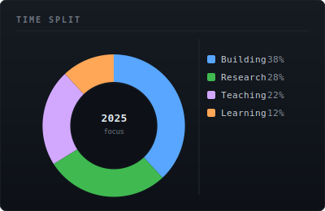

# Artem Melnyk

**EdTech Founder · Researcher · Builder · [@melnykk-dev](https://github.com/melnykk-dev)**

---

> *"Education should be free. But it also shouldn't be boring. The future of learning isn't just about accessing information — it's about enjoying the process of acquiring it."*

---

## Overview

| Courses Created | Certificate Programmes | Research Fields |
|:-:|:-:|:-:|
| **31+** | **28** | **3** |
| Free · Global Access | Across Erthiox platform | Physics · Env. Sci. · EdTech |

---

## Competency Profile

 

---

## Time Split & Languages

 

---

## Activity

---

## Research

| Field | Focus | Status |
|---|---|:-:|
| Applied Physics | Computational & experimental methods, wave dynamics |  |
| Environmental Science | Data-driven environmental modelling & analysis |  |
| EdTech | Gamification theory, LMS architecture, accessibility |  |

Published works: [orcid.org/0009-0000-9931-9035](https://orcid.org/0009-0000-9931-9035)

---

## Projects

### All projects are available in public repositories

Source code, documentation, and research artefacts for all ventures and experiments are open and publicly accessible on GitHub.

---

## Contact & Links

---

Artem Melnyk · melnykk-dev · Toronto, Canada

