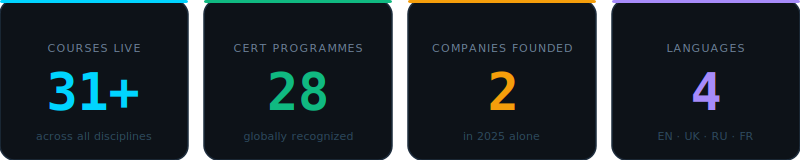
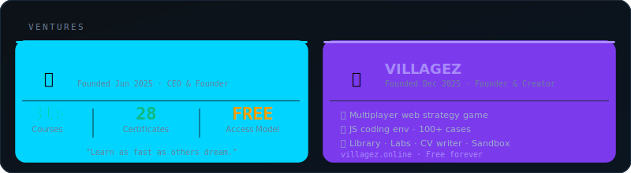
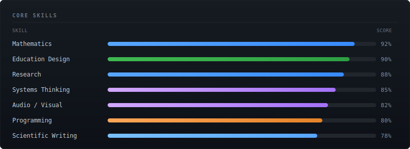
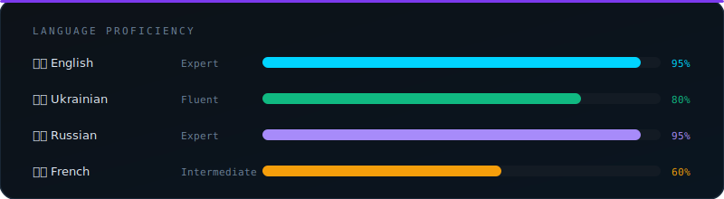
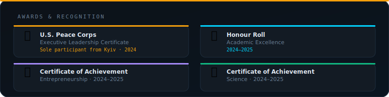
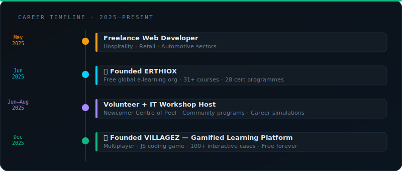

<div align="center">

<!-- ANIMATED HEADER -->


<!-- BADGES -->
<p>
  
  
  
  
</p>

<p>
  <a href="https://villagez.online"></a>
  <a href="https://www.linkedin.com/in/melnykkk"></a>
  <a href="https://melnykkk.medium.com/"></a>
  <a href="https://melnykk.substack.com/"></a>
  <a href="https://orcid.org/0009-0000-9931-9035"></a>
</p>

---

### *"Education should be free. But it also shouldn't be boring.*
### *The future of learning isn't just about accessing information — it's about enjoying the process of acquiring it."*

</div>

---

## 🧭 About Me

```yaml
name:        Artem Melnyk
born:        2008 · Kyiv, Ukraine
based:       Toronto, Ontario, Canada
role:        Founder & CEO @ Erthiox · Creator @ Villagez
research:    Applied Physics · Environmental Science · EdTech
mission:     Make world-class education free, gamified, and global
recognized:  U.S. Peace Corps · Kyiv City State Administration
```

> 🇺🇦 → 🇨🇦 &nbsp; Ukrainian-born builder operating at the intersection of **technology**, **education**, and **scientific research** — building the infrastructure for a world where anyone can learn anything, for free.

---

## 📊 Stats at a Glance

<div align="center">



</div>

---

## 🏢 Ventures

<div align="center">



</div>

<br>

<table>
<tr>
<td width="50%" valign="top">

### 🌐 [Erthiox](https://www.linkedin.com/company/erthiox/)


Free global e-learning org. All course content and certifications powering the Villagez ecosystem.

> *"Learn as fast as others dream."*

| Metric | Value |
|--------|-------|
| 📚 Courses | **31+** |
| 🎓 Certificate Programmes | **28** |
| 💰 Access Model | **Free** |
| 🌍 Reach | **Worldwide** |

</td>
<td width="50%" valign="top">

### 🎮 [Villagez](https://www.linkedin.com/company/villagez/)


Gamified learning platform delivering Erthiox content through an interactive adventure-style interface.

🕹️ **Platform Features:**
- Multiplayer web strategy game
- JavaScript coding env · 100+ cases
- Guided sandbox environment
- Platform-wide library & encyclopedia
- Labs, CV letter writer & more *(weekly updates)*

</td>
</tr>
</table>

---

## 🛠️ Technical Skills

<div align="center">



</div>

---

## 🛠️ Tech Stack

<div align="center">

**Frontend**


**Game Dev**


**Research & Data**


**Design & PM**


</div>

---

## 🗣️ Language Proficiency

<div align="center">



</div>

---

## 🔬 Research

<div align="center">


</div>

| Field | Focus |
|-------|-------|
| ⚗️ Applied Physics | Computational & experimental methods |
| 🌿 Environmental Science | Data-driven environmental research |
| 🖥️ EdTech | Gamification, LMS design, learning accessibility |

📄 Published works: [orcid.org/0009-0000-9931-9035](https://orcid.org/0009-0000-9931-9035)

---

## 🏅 Awards & Recognition

<div align="center">



</div>

<br>

<table>
<tr>
<td>🏛️</td>
<td><strong>Represented Ukraine at governmental-level conferences</strong><br><sub>Kyiv City State Administration</sub></td>
</tr>
</table>

---

## 🗓️ Career Timeline

<div align="center">



</div>

---

## 📡 GitHub Stats

<div align="center">


<br/>


<br/>


</div>

---

## 📬 Get In Touch

<div align="center">

| Platform | Link |
|----------|------|
| 📧 Email | [melnykk.cooperation@gmail.com](mailto:melnykk.cooperation@gmail.com) |
| 💼 LinkedIn | [linkedin.com/in/melnykkk](https://www.linkedin.com/in/melnykkk) |
| 🌐 Platform | [villagez.online](https://villagez.online) |
| ✍️ Medium | [melnykkk.medium.com](https://melnykkk.medium.com/) |
| 📰 Substack | [melnykk.substack.com](https://melnykk.substack.com/) |

</div>

---

<div align="center">


</div>
